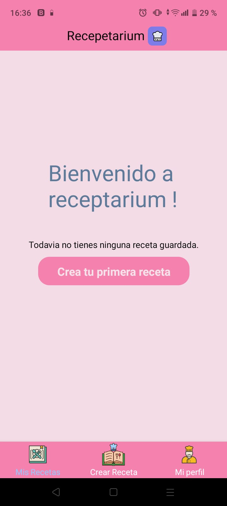
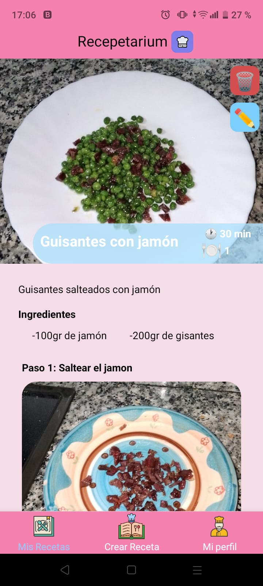

<a name="readme-top"></a>

[](https://www.linkedin.com/in/david-pérez-romero-b8a57a292/)


<br />
<div align="center">
  <a href="https://github.com/DavidPrDev/receptarium1.0">
    
  </a>

  <h3 align="center">Receptarium</h3>
<p align="center">
    
    
</p>
</div>

<details>
  <summary>Contenido de la aplicación</summary>
  <ol>
    <li>
      <a href="#Sobre el proyecto">Sobre el proyecto</a>
      <ul>
        <li><a href="#Tecnologías empleadas">Tecnologías</a></li>
      </ul>
    </li>
    <li>
      <a href="#Empezando">Empezando</a>
      <ul>
        <li><a href="#Prerrequisito">Prerrequisitos</a></li>
        <li><a href="#Backend"> Instalacion Backend </a>
            <ul> 
                <li><a href="#Caracteristicas  Api">Caracteristicas</a></li>
                <li><a href="#Documentación Swagger">Documentación Swagger</a></li>
            </ul>
        </li>
          <li><a href="#Instalación">Frontend</a>
            <ul> 
                <li><a href="#roadmap">Instalación</a></li>
                <li><a href="#usage">Documentación </a></li>
            </ul>
        </li>
      </ul>
    </li>
   
  </ol>
</details>


<!-- ABOUT THE PROJECT -->
## Sobre el proyecto 


Receptarium es una aplicación para almacenar y gestionar tus recetas de una forma sencilla para android construida con una api de laravel y un frontal en react-native.


<p align="right">(<a href="#readme-top">Volver al incio</a>)</p>


### Tecnologías empleadas

Este proyecto está construido con react-native como frontal y una api de laravel para la autenticación y crud de las recetas , haciendo uso de mysql como bd.


* [](https://laravel.com/)

* [](https://es.reactjs.org/)


* [](https://www.mysql.com/)

<p align="right">(<a href="#readme-top">Volver al incio</a>)</p>


<!-- GETTING STARTED -->
## Empezando

Para iniciar este proyecto necesitamos copiar el repositorio y instalar el backend y el frontend como se describe más adelante.

### Prerrequisitos

Empezaremos clonando el repositiorio .
* clonar repositorio 
  ```sh
  git clone https://github.com/DavidPrDev/receptarium1.0.git
  ```

### Backend

Para instalar el backend de laravel seguiremos estos pasos:

1. Configurar el fichero .env con las credenciales de nuestra bd.

2. Realizaremos las migraciones
   ```sh
   php artisan migrate
   ```
   
3. Poblaremos la bd con datos de prueba mediante seeders.
   ```sh
   php artisan db:seed
   ```
      <p align="right">(<a href="#readme-top">Volver al incio</a>)</p>
## Caracteristicas  Api

Algunas de las características más destacables de la api son :
 
 * Sanctum como Middleware.

 * Custom request para los datos introducidos.

 * Custom policy para autorizar el acceso a un recurso en particular.

  * Documentacion con swagger.

<p align="right">(<a href="#readme-top">Volver al incio</a>)</p>


## Documentación Swagger

Puede consultar la documentación interactiva de swagger generada para este proyecto sobre los endpoint y esquemas sobre los  modelos.

<a href="https://api-receptarium.david-pr.com/api/documentation">Visita la documentacion de swagger </a>


<p align="right">(<a href="#readme-top">Volver al incio</a>)</p>


